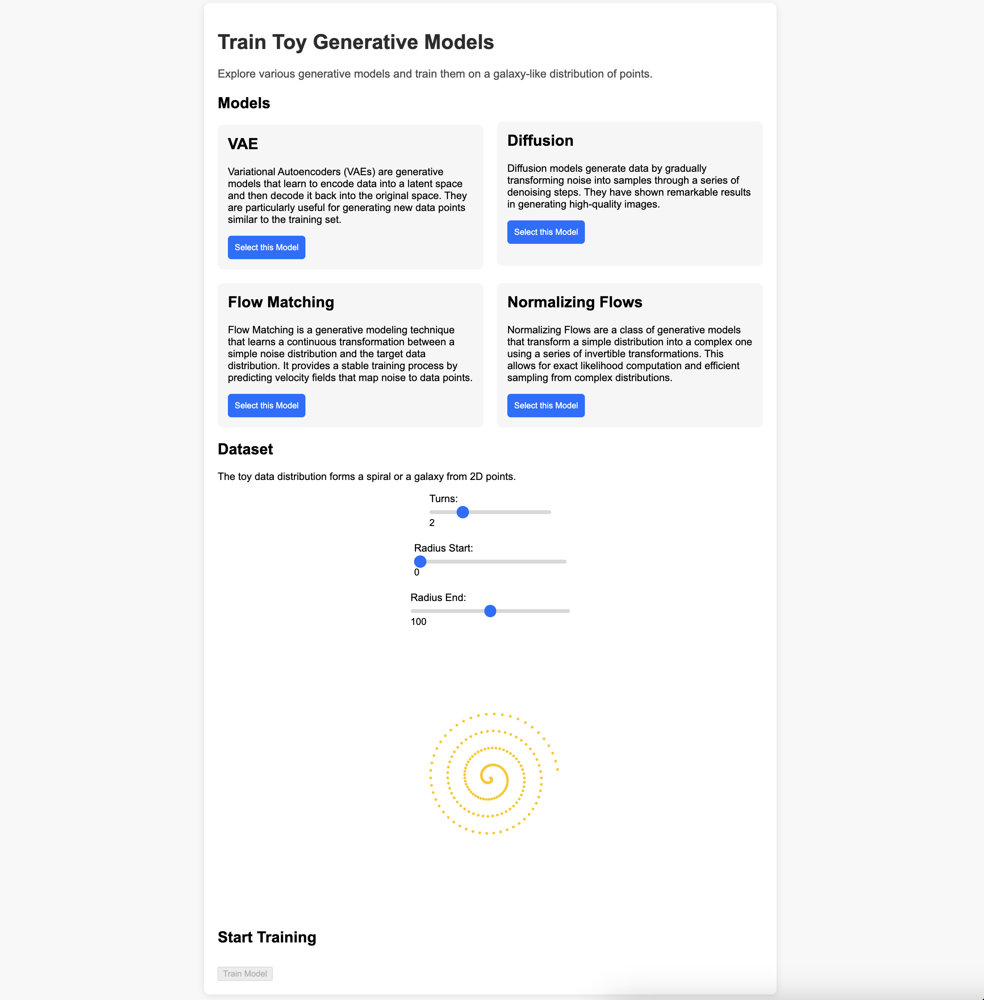

# Galactic Gaze
[In progress] A simple application for training toy generative models on 2D data distribution of spirals.




## Installation and Usage

```bash
python -m venv venv
source venv/bin/activate
pip install -e .
uvicorn gaze.main:app --reload
```

```bash
cd frontend
npm install
npm start
```
